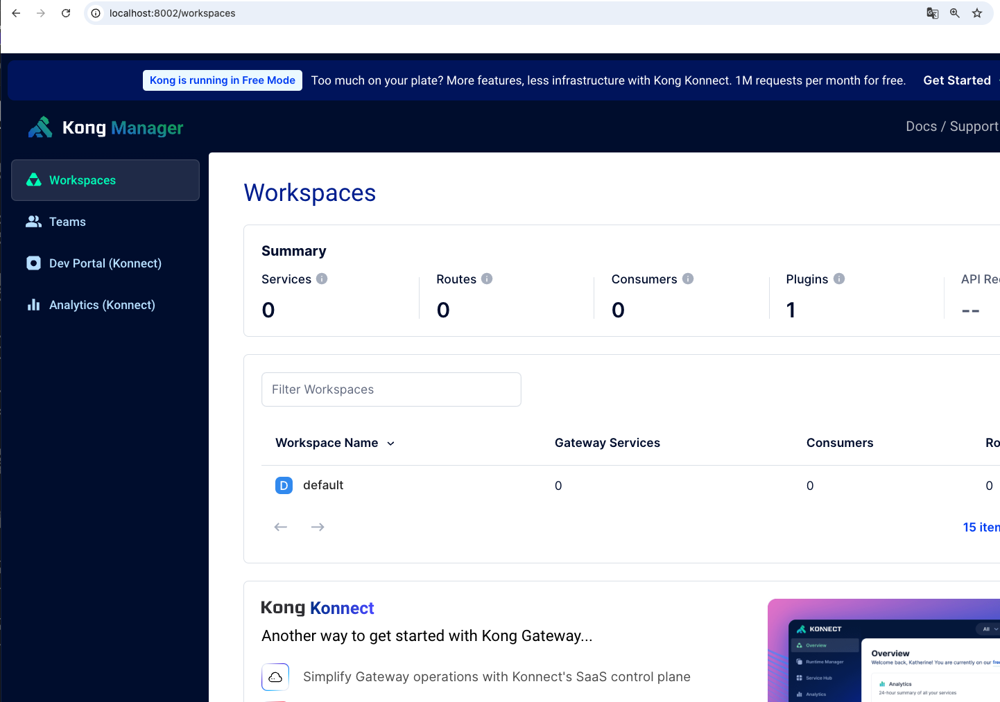
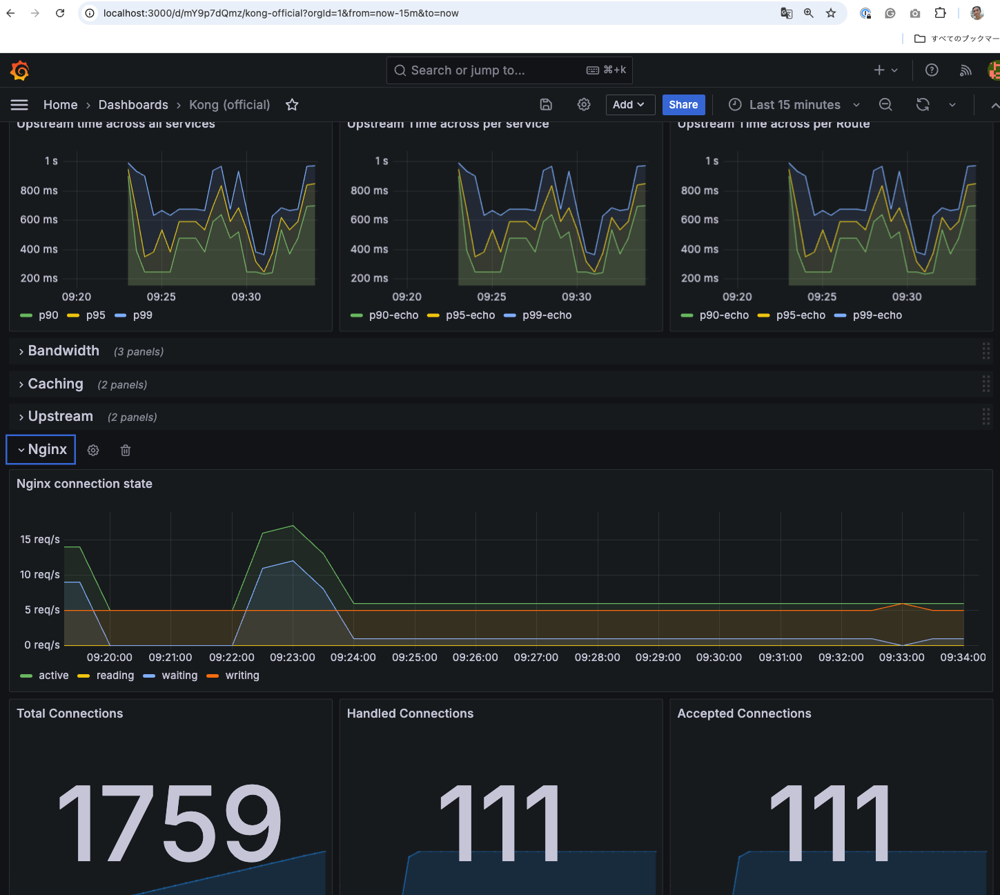

# Kong Observability Demo Stack with Prometheus/Grafana
## 概要
このリポジトリはKongの観測に必要なコンポーネントを纏めたDocker Composeのデモ環境です。Kong GatewayとKongのメタデータストアであるPostgresの他に、PrometheusとGrafanaのインスタンスも立ち上がります。



Kongの[Prometheus Plugin](https://docs.konghq.com/hub/kong-inc/prometheus/)を利用する事によりKongがメトリクスのエンドポイントを公開し、Prometheusのスクレイプによってメトリクスを収集します。収集したメトリクスを可視化するGrafanaのダッシュボードは[Kongのオフィシャルダッシュボード](https://github.com/Kong/kong/blob/master/kong/plugins/prometheus/grafana/kong-official.json)を利用しています。



## 手順
このリポジトリをクローン後、メインフォルダに移動し
```bash
docker compose up -d
```
を実行する。

作業後は
```bash
docker compose down
```
を実行する。

> [!CAUTION] 
> 対象メトリクスの項目数やこの環境の実行時間によってはPrometheusのストレージが大きくなる事があります。その場合は停止後に ```docker volume prune``` を利用して不要ストレージをクリーンアップしてください。

#### Kong Manager
[http://localhost:8002](http://localhost:8002)

#### Kong Prometheusメトリクス エンドポイント
[http://localhost:8001/metrics](http://localhost:8001/metrics)

#### Prometheus
[http://localhost:9090](http://localhost:9090)

### Grafana
[http://localhost:3000](http://localhost:3000)

user id: ```kong```

password: ```kong```

## Kong Prometheus Plugin
メトリクスは[Kong Prometheus Plugin](https://docs.konghq.com/hub/kong-inc/prometheus/)を有効化することによりスクレープ可能となります。このプラグインは特定Service、Route等に指定する事ができますが、今回はGlobal（対象エンティティを指定しない）事によりKong Gateway全体のメトリクスを出力しています。

プラグインはKong Manager上にて手動で設定する事もできますが、今回は[Kong Gateawy Admin API](https://docs.konghq.com/gateway/latest/admin-api/)に対してRESTコールをする事により自動設定しています。設定内容については[/scripts/pruglins.sh](./scripts/plugins.sh)を参照してください。

## Prometheus
設定は[assets/prometheus/prometheus.yml](./assets/prometheus/prometheus.yml)に定義されています。ここではスクレープ対象エンドポイントの設定と併せて、```scrape_interval```を設定しています。

## Grafana
Grafanaのダッシュボードは[KongのオフィシャルDashbaord](https://github.com/Kong/kong/blob/master/kong/plugins/prometheus/grafana/kong-official.json)を利用しています。起動時にこのダッシュボードが読み込まれる設定としているので、起動後そのまま利用できます。

## 備考
- Grafana ダッシュボードの```Request rate```、```Latencies```等のメトリクスは実際にKong Gatewayへのトラフィックが発生しない限りメトリクスが無いので表示されません。
- Prometheusの設定では```scrape_interval```を必ず1分以内に設定してください。（デフォルトは```1m```）